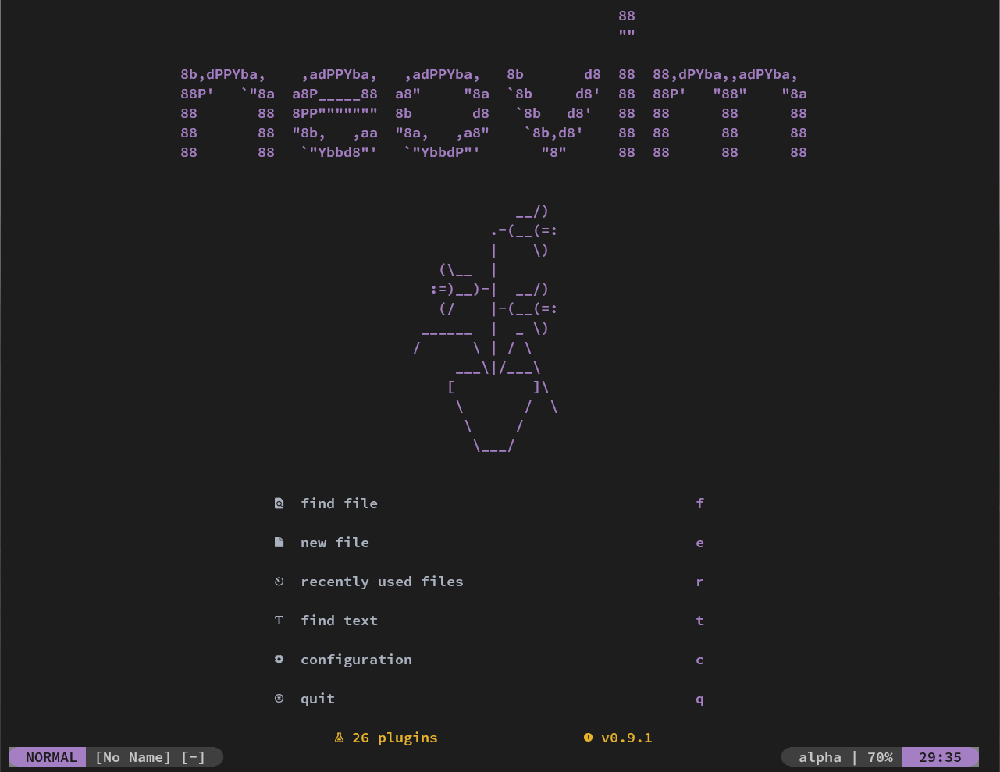

# Neovim Config

I used [this](https://github.com/ThePrimeagen/init.lua) config as a starting point.

## Directories

- `./after/plugin` contains plugin specific configs
- `./lua/config` has general nvim stuff

## Preview
